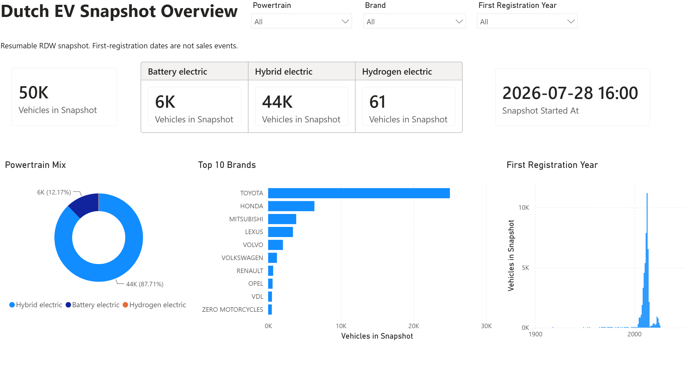
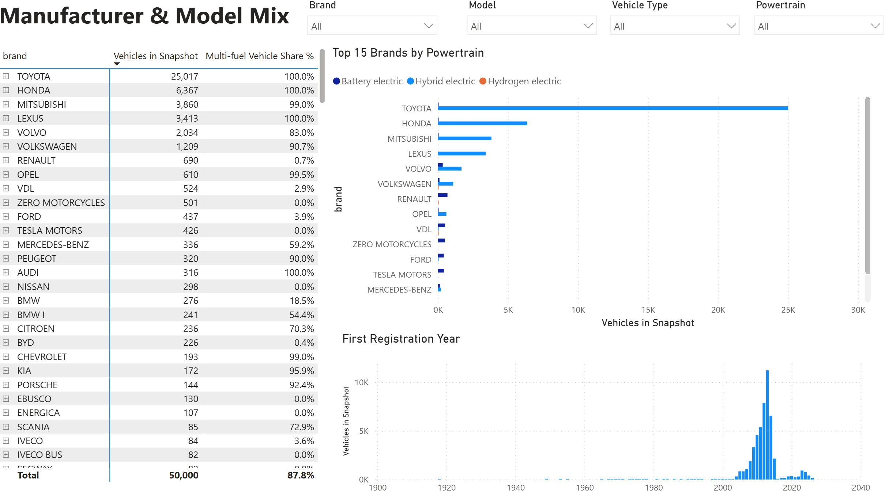
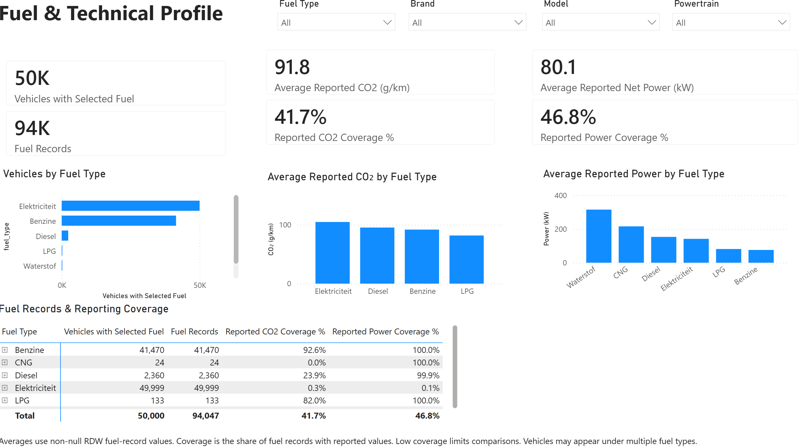
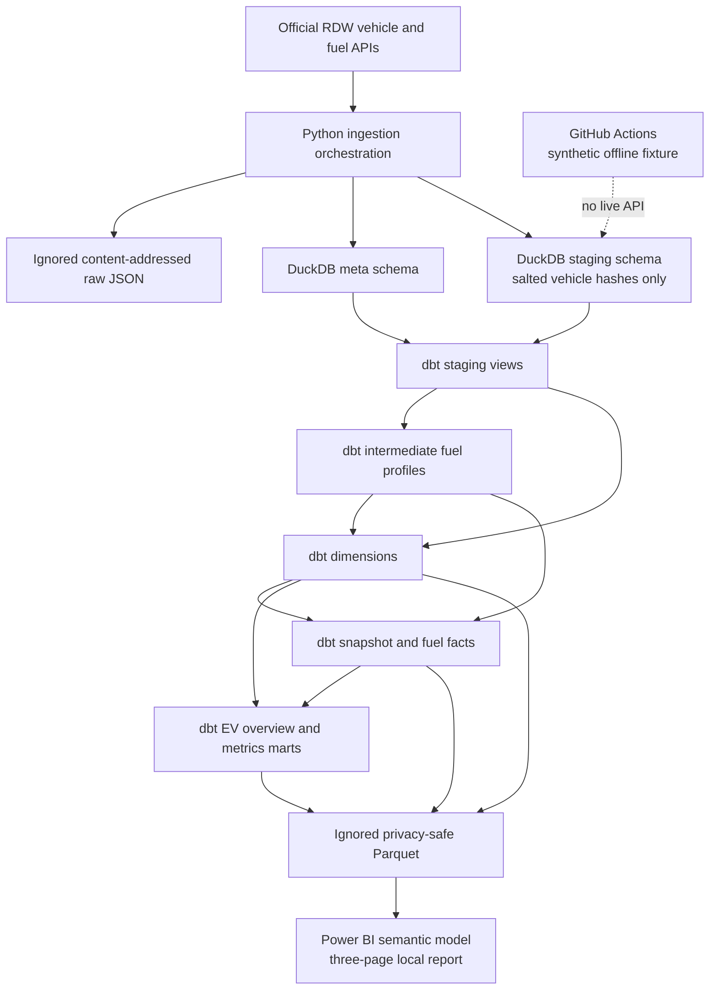

# Dutch EV Data Platform

[](https://github.com/jingboli8/dutch-ev-data-platform/actions/workflows/ci.yml)

A privacy-aware local data engineering and BI portfolio project that turns
official Dutch RDW open data into a resumable DuckDB ingestion layer, a
documented dbt dimensional model, privacy-safe Parquet outputs, and a
repository-local three-page Power BI Project report. Python owns reliable data
acquisition and privacy controls; dbt owns analytical SQL, lineage,
documentation, and SQL-level tests; Power BI provides the local semantic and
reporting layer.

The project intentionally does not include Azure, Spark, Kafka, Airflow,
Docker, invented performance claims, claimed business impact, or a published
cloud BI deployment.

## Dashboard Preview

### Snapshot Overview

This page summarizes the represented vehicle snapshot, its EV powertrain mix,
leading brands, first-registration-year distribution, and snapshot context.



### Manufacturer & Model Mix

This page explores vehicle counts and multi-fuel share across brands, models,
vehicle types, powertrain categories, and first-registration years.



### Fuel & Technical Profile

This page distinguishes vehicles from fuel-detail records and shows reported
CO2, power, and reporting coverage by fuel type.



### Example Snapshot Results

| Metric | Result |
|---|---:|
| Vehicles | 50,000 |
| Fuel records | 94,047 |
| Hybrid-electric vehicles | 43,856 |
| Battery-electric vehicles | 6,083 |
| Hydrogen-electric vehicles | 61 |
| Reported CO2 coverage | 41.7% |
| Reported power coverage | 46.8% |

These are example results from one bounded, resumable snapshot. They do not
represent the full Dutch vehicle fleet, a vehicle-sales dataset, or a
historical time series. The images are static previews; the dashboard is not
cloud-hosted or publicly interactive. See the
[Power BI documentation](powerbi/README.md) for local setup and metric
interpretation.

## Data sources

- [Open Data RDW: Registered vehicles](https://opendata.rdw.nl/Voertuigen/Open-Data-RDW-Gekentekende_voertuigen/m9d7-ebf2)
  (`m9d7-ebf2`)
- [Open Data RDW: Registered vehicle fuels](https://opendata.rdw.nl/Voertuigen/Open-Data-RDW-Gekentekende_voertuigen_brandstof/8ys7-d773)
  (`8ys7-d773`)

The source is accessed through the official Socrata resource endpoints in
`config/settings.toml`.

## Architecture



Only one EV identifier page and its bounded detail batches are held in memory.
Each page is hashed and transactionally upserted before the next keyset page is
requested.

## Responsibility boundary

Python owns:

- RDW API requests, retries, keyset pagination, and resumable snapshots;
- content-addressed raw response persistence and duplicate-payload auditing;
- salted SHA-256 replacement of licence plates before staging;
- DuckDB staging tables, checkpoint state, and operational metadata;
- orchestration of dbt and publication of final Parquet files.

dbt owns:

- thin typed views over Python-owned staging and metadata tables;
- reusable EV fuel-profile and snapshot-context transformations;
- dimensions, facts, and analytical marts;
- relation and column documentation, lineage, and SQL data-quality tests.

Power BI owns:

- the local semantic presentation over the privacy-safe EV overview and fuel
  detail Parquet outputs;
- DAX measures and the single-direction vehicle-to-fuel relationship;
- three recruiter-facing report pages.

Analytical SQL is not maintained in Python. The architectural rationale is
recorded in `docs/adr-001-python-dbt-boundary.md`.

## Ingestion and recovery

The identifier query filters fuel rows to `Elektriciteit` or `Waterstof`, groups
by `kenteken`, orders by `kenteken`, and advances with
`kenteken > last_completed_key`. The key itself is never stored in a checkpoint.
Resume derives it from the SHA-256-verified, Git-ignored raw anchor page.

The end-to-end CLI closes its Python DuckDB connection before starting dbt as a
separate process. Arguments are passed as a list without shell interpolation.
The child process receives `DBT_DUCKDB_PATH` and uses only the repository-local
dbt project and profile.

Checkpoint transformation states are explicit:

- `initializing`: a fresh checkpoint exists, but replacement of the previous
  staging snapshot has not yet completed;
- `in_progress`: extraction may continue from the last durably committed page;
- `staging_complete`: all selected RDW pages are durably committed and Python
  staging checks passed;
- `transformation_failed`: staging remains safe, but dbt failed;
- `completed`: dbt tests and final Parquet publication succeeded.

While dbt is running, the durable checkpoint remains `staging_complete` and
`meta.ingestion_runs.status` is `transforming`. During final publication the
metadata status is `finalizing`. An extraction exception records `interrupted`;
an uncatchable process termination can leave the last earlier durable state,
which is deliberately replayable.

After a dbt failure, run the same command with `--resume`. The pipeline validates
the original configuration and raw anchor, skips RDW extraction, and rebuilds
dbt models from committed staging data.

Parquet files are first written as a complete eight-file set in an ignored
sibling directory and then published by a directory swap. Windows requires two
directory renames, so an uncatchable termination in the narrow swap window can
make the public directory temporarily unavailable; it cannot expose a mixed
old/new set. Resume rebuilds and republishes the complete set, and successful
publication removes abandoned private swap directories.

## Snapshot versus true incremental ingestion

This is resumable snapshot ingestion, not true source-incremental processing.
The published RDW schemas do not provide a reliable row-level update timestamp
or change sequence across both datasets. Dataset-level publication metadata
cannot identify changed rows or deletions.

The public API also does not provide a transactionally frozen snapshot:

- records inserted below an already processed key can be missed in that run;
- records can change or be deleted while keyset pagination is in progress;
- vehicle and fuel detail requests occur at slightly different times;
- the unauthenticated API can throttle large request volumes.

Registration date means RDW first admission. It is not treated as a vehicle sale
or purchase event. The current fact tables do not claim to be a historical
vehicle-change series.

## Dimensional model

All public analytical relations are in the `analytics` schema.

| Model | Grain |
|---|---|
| `dim_vehicle` | One row per salted current-snapshot vehicle key |
| `dim_vehicle_model` | One row per manufacturer, model, and vehicle-type combination |
| `dim_registration_date` | One row per represented non-null first-admission date |
| `dim_powertrain` | One row per EV category and electric/hydrogen/other-fuel flag profile |
| `fact_vehicle_snapshot` | One row per snapshot ingestion and vehicle key |
| `fact_vehicle_fuel` | One row per snapshot ingestion, vehicle key, and RDW fuel sequence |
| `mart_ev_overview` | One denormalized row per vehicle snapshot |
| `mart_ev_metrics` | One row per fuel, manufacturer, model, registration year, and powertrain category |

Powertrain classification preserves three distinct categories:

- `Battery electric`
- `Hybrid electric`
- `Hydrogen electric`

Phase 2 shaped the overview mart for a future Power BI semantic layer and did
not include Power BI files, reports, gateways, or cloud deployment. Phase 3 now
adds a repository-local Power BI Project over the published Parquet layer. It
has not been published to Power BI Service and includes no gateway or cloud
deployment.

## Power BI report

`powerbi/DutchEVAnalytics.pbip` contains three report pages:

- **Snapshot Overview** summarizes the bounded RDW vehicle snapshot;
- **Manufacturer & Model Mix** explores brand and model composition;
- **Fuel & Technical Profile** compares fuel-record counts, reported technical
  values, and their coverage.

The semantic model imports only `analytics_mart_ev_overview.parquet` and
`analytics_fact_vehicle_fuel.parquet`. The tracked `ParquetRoot` value is the
non-working `SET_LOCAL_PARQUET_ROOT` publication placeholder; set it to the
local Parquet directory in Power BI Desktop before refreshing. The report is a
local portfolio artifact and has not been published to a cloud service. See the
[Power BI documentation](powerbi/README.md) for setup, model grain, metric
interpretation, privacy guidance, and the validation scope.

## Setup

PowerShell:

```powershell
python -m venv .venv
.\.venv\Scripts\python.exe -m pip install --no-cache-dir -e ".[dev]"
Copy-Item .env.example .env
```

Dependencies are intentionally limited:

- `requests`: HTTP timeouts, validation, and bounded retry handling;
- `duckdb`: local staging warehouse and Parquet I/O;
- `pandas`: page-sized typed registration with DuckDB;
- `dbt-core` and `dbt-duckdb`: repository-owned SQL modelling and tests;
- `pytest` and `ruff` in the development extra.

No global dbt installation or user-global `~/.dbt` profile is used.

## Run the end-to-end pipeline

Small snapshot:

```powershell
.\.venv\Scripts\dutch-ev.exe --fresh --limit 500 --page-size 250
```

Larger bounded snapshot:

```powershell
.\.venv\Scripts\dutch-ev.exe --fresh --limit 50000 --page-size 1000
```

Resume the same configured snapshot:

```powershell
.\.venv\Scripts\dutch-ev.exe --resume --limit 50000 --page-size 1000
```

Complete qualifying snapshot:

```powershell
.\.venv\Scripts\dutch-ev.exe --fresh --limit 0 --page-size 1000
```

`--limit 0` means no matched-vehicle cap. A resume must use the same endpoints,
data and database locations, limit, page size, detail batch size, and hash salt.

## Run dbt directly

The profile defaults to the repository-local warehouse. To select another
warehouse for the current PowerShell session:

```powershell
$env:DBT_DUCKDB_PATH = (Resolve-Path data\warehouse\dutch_ev.duckdb).Path
```

Then:

```powershell
.\.venv\Scripts\dbt.exe deps --project-dir dbt --profiles-dir dbt
.\.venv\Scripts\dbt.exe debug --project-dir dbt --profiles-dir dbt
.\.venv\Scripts\dbt.exe parse --project-dir dbt --profiles-dir dbt
.\.venv\Scripts\dbt.exe build --project-dir dbt --profiles-dir dbt
```

dbt builds eight public dimensional and mart tables, five staging/intermediate
views, and runs generic plus singular data tests.

## Inspect dbt lineage and documentation

Generate documentation:

```powershell
.\.venv\Scripts\dbt.exe docs generate --project-dir dbt --profiles-dir dbt
.\.venv\Scripts\dbt.exe docs serve --project-dir dbt --profiles-dir dbt
```

The generated manifest, catalog, run results, compiled SQL, and dbt logs remain
ignored under `dbt/target/` and `dbt/logs/`.

## Offline fixture and CI

GitHub Actions runs `.github/workflows/ci.yml` for pushes and pull requests
targeting `main`. It:

1. installs the project in Python 3.11;
2. runs Ruff and pytest;
3. creates a temporary synthetic DuckDB fixture;
4. runs `dbt deps`, `dbt debug`, `dbt parse`, and `dbt build`;
5. audits tracked and generated files.

The fixture builder is separate from the production CLI:

```powershell
.\.venv\Scripts\python.exe scripts\build_ci_fixture.py `
  --database data\ci\fixture.duckdb
```

It uses explicit `TEST_VEHICLE` examples for electricity-only, petrol and diesel
hybrids, hydrogen-only, hydrogen with another fuel, and an unexpected valid fuel
description, including missing optional values. Only salted hashes are written
to its staging tables. A post-build verifier checks classifications, grains,
and null-measure preservation. CI never calls the live RDW API.

## Existing Phase 1 warehouse migration

An existing Phase 1 warehouse can be upgraded in place without requesting RDW
again:

```powershell
.\.venv\Scripts\dutch-ev.exe --transform-only
```

The orchestrator removes only the three known Phase 1 analytical tables
(`ev_vehicles`, `ev_fuel_details`, and `ev_metrics`) and the known dbt-owned
relations before rebuilding. Arbitrary user relations are not dropped.

`--transform-only` accepts only the already privacy-safe staging tables. It does
not read raw data, create a checkpoint, or call RDW. It is also safe to repeat
after a dbt-only migration failure.

For Phase 2 snapshots, use `--resume` after a dbt failure. If an extraction
checkpoint, raw anchor, configuration fingerprint, database, or private salt is
missing or inconsistent, extraction resume fails clearly; start a documented
`--fresh` snapshot rather than mixing states.

## Quality checks

Local validation:

```powershell
.\.venv\Scripts\ruff.exe check .
.\.venv\Scripts\python.exe -m pytest
.\.venv\Scripts\dbt.exe build --project-dir dbt --profiles-dir dbt
.\.venv\Scripts\python.exe -m pip check
.\.venv\Scripts\python.exe scripts\audit_tracked_files.py
```

dbt tests cover:

- model primary keys and fact grain;
- non-null required keys;
- fact-to-dimension relationships and orphan fuel facts;
- accepted powertrain categories;
- valid first-admission date ranges;
- non-negative reported numeric measures;
- staging-to-fact row-count reconciliation;
- absence of plaintext identifier column names.

Example analytical SQL is available in `sql/analytics_examples.sql`.

## Privacy

Plaintext licence plates are temporarily necessary to join the two public APIs.
They may exist only in process memory and the ignored raw zone.

- `.env`, `.state`, `data`, `.venv`, logs, DuckDB, and Parquet are ignored;
- raw pages are content-addressed and verified before checkpoint recovery;
- the real hashing salt is generated under `.state/privacy_salt` unless supplied
  through the ignored environment;
- staging, dbt models, checkpoints, logs, and Parquet never store plaintext
  licence plates;
- repository-local dbt configuration contains no credentials or absolute local
  drive paths;
- Power BI `.pbi` workspaces, caches, local settings, and security bindings are
  ignored;
- tracked Power BI source uses a portable `ParquetRoot` placeholder instead of
  a machine-specific path;
- CI uses clearly synthetic data and writes only privacy-safe hashes.

Do not publish raw files, the warehouse, checkpoints, logs, generated dbt
artifacts, Parquet files, or the salt.
